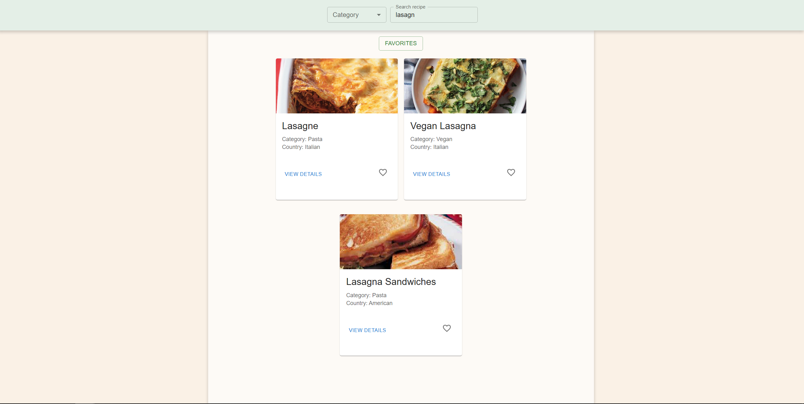

## Overview

Recipe Finder is a web application built with React + Vite that allows users to search for recipes using TheMealDB API. The app features category-based filtering, pagination, and a favorites page where users can save their favorite recipes.

Home page:


Recipe page:


Favorite page:


Search recipe by name:


## Features

- Recipe Search: Fetch recipes from TheMealDB API.
- Category Filtering: Display recipes based on selected categories.
- Pagination: Navigate through recipe pages.
- Favorites Management: Add or remove recipes from favorites.
- Total Ingredients List: View a combined list of ingredients from all favorite recipes.
- Smooth UI: Uses Material UI for styling and a clean user experience.

## Installation & Setup

Install Dependencies

```
npm install
```

Run the App

```
npm run dev
```

The app will be available at http://localhost:5173/ by default.

## Technologies Used

- [Vite](https://vite.dev/)
- [Redux Toolkit](https://redux-toolkit.js.org) (for state management)
- [React Router](https://reactrouter.com) (for navigation)
- [Material UI](https://mui.com) (for UI components)
- [TheMealDB API](https://www.themealdb.com/api.php?ref=apilist.fun) (for fetching recipe data)
- [TypeScript](https://www.typescriptlang.org/) (for type safety)
